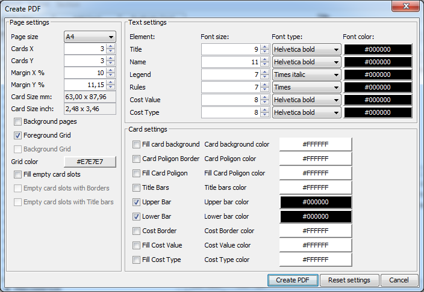

# CardEditor
A Java Application to edit and build pdfs with cards for Warhammer 40K. Generates PDF files with card generated with the correct sizes to print, cut & use in your Warhammer 40K games.
Includes options to import content directly from Wahapedia.

Needs Java 8+ installed.

